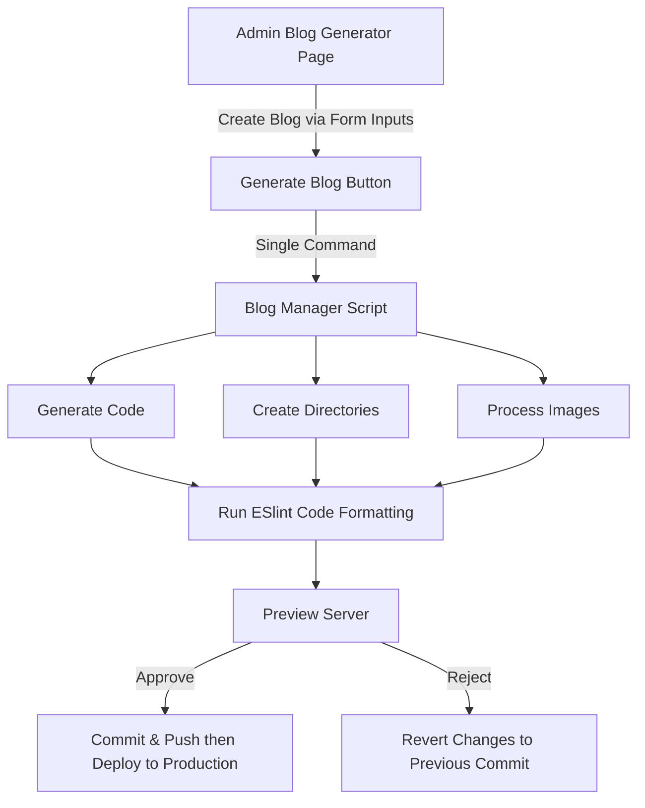

# Around The World 50s 🌎✈️

[](https://royschor.github.io/aroundtheworld50s)

> A mother's journey around the world, made possible through automated blogging magic ✨

## 📖 Overview

This is not just another travel blog - it's a love letter to technology making content creation accessible to everyone. Built specifically for my mother who loves to share her adventures but isn't familiar with coding, this platform transforms the complex world of web development into a single, simple command.

### 🎯 Key Features

- **One-Command Blog Publishing**: Transform a folder of content into a beautiful blog post with a single command
- **Automated Code Generation**: Automatically creates React components, directories, and all necessary code
- **Built-in Preview System**: Test your blog post in a development environment before publishing
- **Git Integration**: Handles all version control automatically
- **Code Quality Assurance**: Automatic code formatting and linting

## 🤖 Automation Magic

The heart of this platform is its powerful automation script that handles everything from file processing to deployment:

### ⚠️ Important Note
All commands must be run from the project root directory. Before running any command, make sure you're in the correct directory:
```bash
cd path/to/around-the-world-50s
```

### Features
1. **Content Processing**
   - Downloads and organizes necessary files
   - Parses content and metadata
   - Creates required directories
   - Generates React components automatically

2. **Development & Preview**
   - Launches development server
   - Opens preview in browser automatically
   - Provides real-time feedback

3. **Quality & Deployment**
   - Runs ESLint for code formatting
   - Validates all changes
   - Handles Git operations
   - Deploys to production or reverts changes based on approval

All of this happens automatically with a single command:
```bash
python3 -m scripts.blog_management.blog_manager
```

## 🎨 Admin Interface

The admin interface provides a secure, user-friendly way to manage all aspects of the blog.

<table>
<tr>
<td width="50%">

### Secure Access
Protected admin interface with hashed password authentication:


</td>
</tr>
</table>

### Content Management

<table>
<tr>
<td width="50%">

### Blog Preview
Real-time preview of blog posts as you create them:


</td>
<td width="50%">

#### Flexible Content Sections
Add any type of content with full customization:


</td>
</tr>
</table>

### Preview System

<table>
<tr>
<td width="50%">

#### Gallery Management
Update the home page gallery with live preview:


</td>
<td width="50%">

#### Gallery Preview
See exactly how your gallery changes will look:


</td>
</tr>
</table>

<table>
<tr>
<td width="50%">

#### Tips Section
Edit travel tips with ease:


</td>
<td width="50%">

### Markdown Support
Write content in user-friendly Markdown with live HTML preview:


</td>
</tr>
</table>


## 🛠️ Technical Flow



## 📚 For Developers

Interested in the technical details? Check out these specific READMEs:
- [Blog Management System](./scripts/blog_management/README.md)
- [Gallery Management](./scripts/gallery_management/README.md)
- [Tips Management](./scripts/tips_management/README.md)

---

Built with ❤️ for my mother, making her travel stories accessible to the world.
