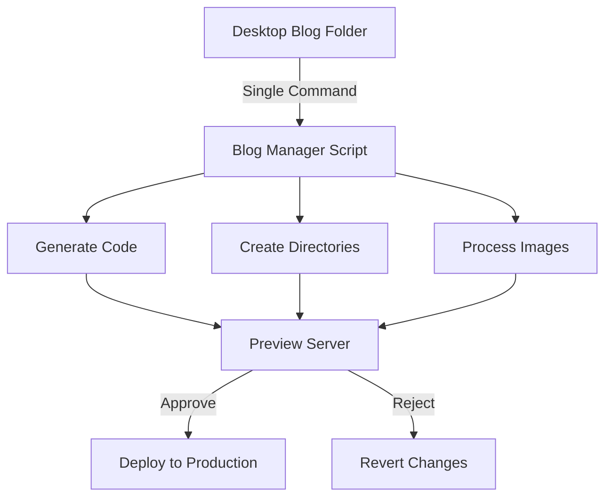

# Around The World 50s 🌎✈️

[](https://royschor.github.io/aroundtheworld50s)

> A mother's journey around the world, made possible through automated blogging magic ✨

## 📖 Overview

This is not just another travel blog - it's a love letter to technology making content creation accessible to everyone. Built specifically for my mother who loves to share her adventures but isn't familiar with coding, this platform transforms the complex world of web development into a single, simple command.

### 🎯 Key Features

- **One-Command Blog Publishing**: Transform a folder of content into a beautiful blog post with a single command
- **Automated Code Generation**: Automatically creates React components, directories, and all necessary code
- **Built-in Preview System**: Test your blog post in a development environment before publishing
- **Git Integration**: Handles all version control automatically
- **Code Quality Assurance**: Automatic code formatting and linting

## 🚀 The Magic Behind the Scenes

[Insert screenshot of the admin blog generator interface here]

### How It Works

1. **Simple Content Preparation**
   - Create a folder on the Desktop with your blog content
   - Include your photos, text, and any other media

2. **One Command Does It All**
   ```bash
   python3 -m scripts.blog_management.blog_manager
   ```

3. **Automated Magic** ✨
   - ✅ Creates necessary directories
   - ✅ Generates React components
   - ✅ Sets up routing
   - ✅ Handles image processing
   - ✅ Updates navigation
   - ✅ Manages dependencies

[Insert screenshot of the automated file generation process here]

4. **Preview & Quality Assurance**
   - 🔍 Automatically launches a development server
   - 👀 Preview your blog post exactly as it will appear
   - 🎨 Runs code formatting (ESLint)
   - ⚡ Tests in a staging-like environment

[Insert screenshot of the preview environment here]

5. **Simple Publishing Flow**
   - ✅ Confirm changes: Automatically commits and deploys
   - ❌ Not happy? One click to revert all changes

## 🛠️ Behind the Scenes

The system handles all the complex tasks automatically:



## 📚 For Developers

Interested in the technical details? Check out these specific READMEs:
- [Blog Management System](./scripts/blog_management/README.md)
- [Gallery Management](./scripts/gallery_management/README.md)
- [Tips Management](./scripts/tips_management/README.md)

## 🌟 The Result

A beautiful, professional travel blog that anyone can update - no coding required!

[Insert screenshot of the final blog website here]

---

Built with ❤️ for my mother, making her travel stories accessible to the world.
